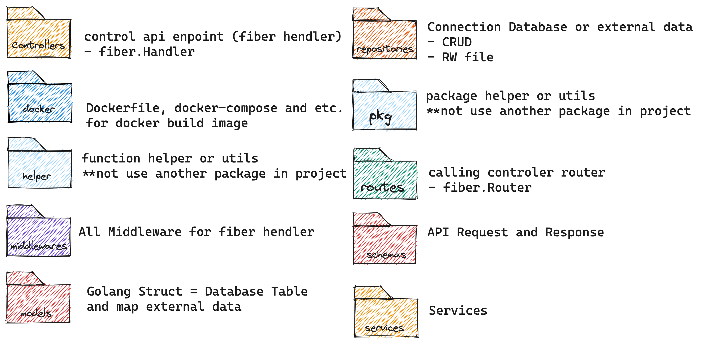

# Github Template API Service with Fiber V2 Framework 

> The following is a folder structure pattern that I use 
> [Golang Clean Architecture - https://github.com/restuwahyu13/go-clean-architecture](https://github.com/restuwahyu13/go-clean-architecture) 
> 

### Root Folder Structure



### Go Import Flow


## Prerequisites

- [Go version 1.21 or above](https://golang.org/)
- [taskfile.dev](https://taskfile.dev/) - same `makefile` but config with `yaml` file
- [Cobra-cli](https://github.com/spf13/cobra-cli)  - create cli with project
- [Swag Go](https://github.com/swaggo/swag) - Swag converts Go annotations to Swagger Documentation 2.0. 


## How to setup

1. Init Go Module
    ```bash
    go mod init github.com/xxx/xxx
    ```
2. Download Go Module
  
    with `taskfile`
    ```bash
    task mod
    ```
    or with `go mod`
    ```bash
    go mod download
    go mod tidy
    go mod vendor
    ```
3. Uncomment files

    - [`main.go`](./main.go) - line: `26`
    - [`cmd/serv.go`](./cmd/serv.go) - line: `19 - 33`
    - [`routes/0route.go`](./routes/0route.go) - line: `16 - 21`

4. Rename [`default.env`](./default.env) to [`.env`](./.env)
    ```bash
    mv default.env .env
    ```

## How to Run:

Run `dev` for start server dev mode:

```bash
task dev
```

Run `swag` for generate swagger docs:

```bash
task swag
```

Run `build` for build go binary file

(output directory: `./build/`)
```bash
task build
```

Run `docker-build` fors Build Docker Image:

```bash
task docker-build
```